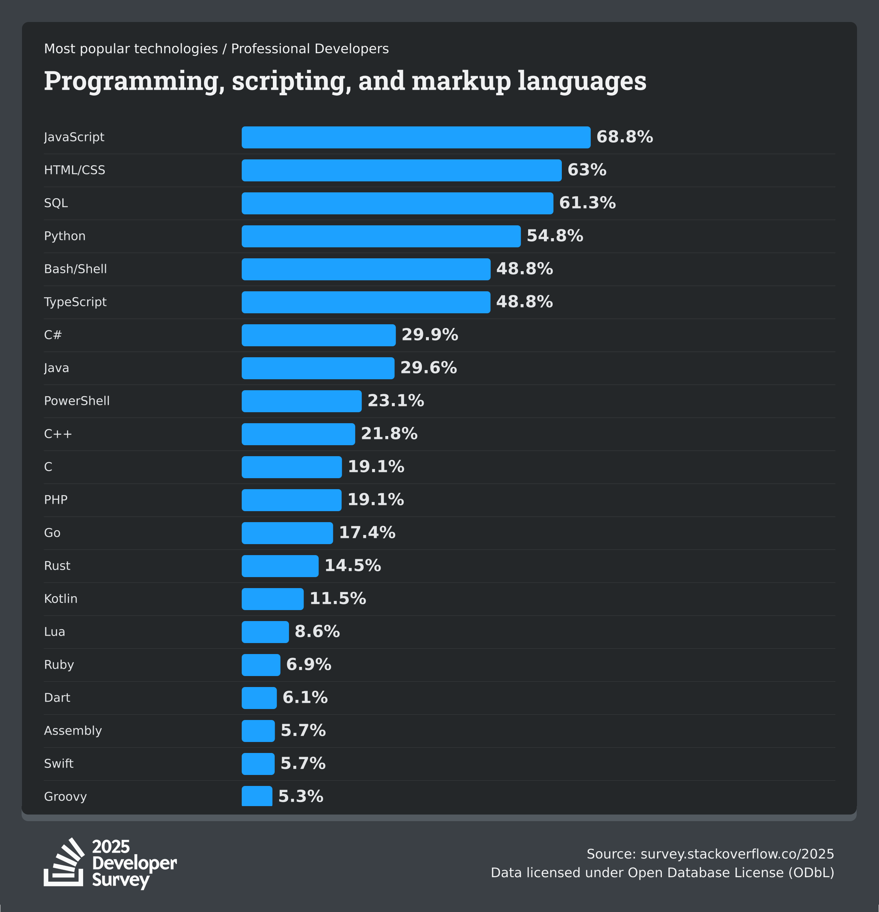

<!-- _class: default -->
<!-- _paginate: false -->

# Gleam + TypeScript
## Full-Stack Type Safety With Inertia-Wisp

**Michael Buhot**

---

<!-- _paginate: false -->

## Acknowledgments


[alembic.com.au](https://alembic.com.au)

Thank you to **Alembic** for supporting this work!


---

## About Me

**Michael Buhot**
Eningeering Manager @ Alembic


- Functional programming fan from Brisbane, Australia
- Default stack is Elixir, Ash, Phoenix LiveView
- Excited about Gleam, typed FP on the BEAM
- Exploring coding assistants

---

<!-- _class: default -->

# The Pitch for Inertia-Wisp

**The Frontend You Know**
**The Backend You'll Love**
**With Type-Safe Integration**

---

## The Frontend You Know

<div class="columns">
<div>


</div>
<div>

- React: most used frontend framework
- Huge ecosystem
- Many talented developers

```typescript
function UserList({ users }: { users: User[] }) {
  return (
    <ul>
      {users.map(user => <li key={user.id}>{user.name}</li>)}
    </ul>
  );
}
```

</div>
</div>

---

## The Frontend You Know

<div class="columns">
<div>



</div>
<div>

- Javascript: Most used language
- TypeScript: Trailing only Python, JS for general purpose languages

```typescript
interface User {
  id: number
  name: string
  email: string
}
```

</div>
</div>

---

## The Backend You'll Love

<div style="display: flex; justify-content: center; align-items: center; margin: 2em 0;">

 

</div>

<div class="left-align">

✅ **Simplicity** - code that's easy to understand and maintain
✅ **Type safety** - compile-time guarantees
✅ **Fast builds** - instant feedback
✅ **Clear errors** - that tell you exactly what's wrong
✅ **Excellent Tooling** - build tool + language server
✅ **BEAM power** - fault tolerance, concurrency, scalability

</div>

---

## The Backend You'll Love

```gleam
fn route_request(req: wisp.Request) -> wisp.Response {
  case req.method, wisp.path_segments(req) {
    http.Get, [] -> home.home_page(req)
    http.Get, ["news"] -> news.news_feed(req)
    http.Get, ["news", "article", id] -> news.news_article(req, id)
    _, _ -> wisp.not_found()
  }
}
```
---

## With Type-Safe Integration

**The challenge:** How do you connect different languages type-safely?

**The solution:** Inertia.js as the bridge

- Backend (Gleam) sends typed props
- Frontend (React) receives typed props
- Types compile from Gleam → TypeScript
- One source of truth

**You get the best of both worlds.**


<!-- _class: default -->

# What Makes Gleam Special?

---

## Many Languages Claim "Simple"

**Lisp Family**
→ Small core + powerful metaprogramming
→ Build your own language

**Go**
→ Limited features
→ Fewer ways to do things wrong

**Python**
→ Readable syntax
→ "Looks like English"

---

## Gleam's Simplicity is Different

**Simplicity for the application programmer**

Building and maintaining programs, not building language features.

---

## Gleam's Paradigm: Three Things

**1. Declare types** - describe your data

```gleam
pub type User {
  User(name: String, email: String)
}
```

**2. Write functions** - transform values of those types

```gleam
pub fn greet(user: User) -> String {
  "Hello, " <> user.name
}
```

**3. Organize in modules** - map directly to filesystem

```
src/user.gleam → user module
```

---

## No Metaprogramming = Syntactic Familiarity

❌ No macros changing syntax
❌ No custom DSLs to learn
❌ No "magic" code generation

✅ Every Gleam file you open feels familiar
✅ Understand code by reading:
  • Function type signatures
  • Type definitions
  • The actual implementation

---

## Simple Type System = Single Source of Truth

❌ No ad-hoc polymorphism
❌ No type classes / traits
❌ No higher-kinded types

✅ Every function has **ONE** definition

**Example:**
```gleam
import gleam/list

list.map(users, transform_fn)
```

Where does `list.map` come from?
→ `gleam/stdlib/src/list.gleam` - one definition, that's the code.


---

## Why This Matters Now

**84% of developers using AI tools** (2025 Survey)

AI-assisted development makes learning new languages faster than ever:
- Gleam's simplicity is perfect for AI assistance
- Clear error messages help AI fix mistakes
- You can be productive in hours, not weeks


---

## Why This Matters for Your Team

**For Humans:**
✅ Fast onboarding - whole language fits in your head
✅ Easy code reviews - less "clever" code
✅ Predictable maintenance - code does what it looks like

**For AI Assistants:**
✅ Small syntax = fewer tokens to learn
✅ No metaprogramming = no context tricks
✅ Single definitions = AI reads actual code
✅ Explicit imports = clear dependencies

**Result: Productive in hours, not weeks**

---

## And You Get the BEAM

✅ Fault tolerance
✅ Massive concurrency
✅ Distributed clustering
✅ Hot code reloading
✅ Battle-tested (30+ years)

**All without language complexity.**

---

## The Trade-offs: Let's Be Honest

**1. Embedded DSLs aren't really possible**
- Elixir: `Ecto.Query.from(...)` ❌
- Gleam: External `.sql` files → codegen ✅
- Example: Squirrel for type-safe SQL queries

**2. Generic abstractions need explicit dictionaries**
- Haskell: `sort :: Sortable a => [a] -> [a]` ❌
- Gleam: `list.sort(items, compare_fn)` ✅
- Dictionary passing style - more verbose, always explicit

---

## Why These Trade-offs Are Acceptable

✅ Most application code doesn't define new embedded DSLs, typically library code
✅ Explicit is better than implicit for maintainability
✅ AI handles explicit code better than implicit magic
✅ You can still build the same functionality - it just looks different

---

<!-- _class: default -->

# Demo Application

---

## The User Experience

- **SPA-like navigation** - no full page reloads
- **Instant feedback** - smooth transitions
- **Server-side rendering** - for first load
- **Progressive enhancement** - works without JavaScript

---

## Architecture Overview

```
┌─────────────┐       ┌──────────────┐       ┌─────────────┐
│   Backend   │       │  Inertia.js  │       │  Frontend   │
│             │◄──────┤              ├──────►│             │
│ Gleam+Wisp  │       │   (Bridge)   │       │ React+TS    │
└─────────────┘       └──────────────┘       └─────────────┘
```

**Key Insight:** Each world stays in its comfort zone

---

<!-- _class: default -->

# Understanding Inertia.js
## The Bridge

---

## SPA UX with Traditional Backends

**What Inertia.js gives you:**
- Single-page application user experience
- Without building a separate API
- Server-side routing and rendering
- Client-side navigation and state

---

## Clear Separation of Concerns

**Backend Responsibilities (Gleam + Wisp):**
- Routing - which URL goes where
- Navigation - deciding what page to show
- Validations - ensuring data is correct
- Authorization - who can access what
- Data fetching and business logic

---

## Clear Separation of Concerns

**Frontend Responsibilities (React + TypeScript):**
- Rendering props received from backend
- Component-local UI state (forms, modals, etc.)
- Browser history management
- Client-side interactions

---

## Beyond the Basics

**You can still use traditional APIs:**
- Ad-hoc `fetch()` calls work fine
- Inertia doesn't prevent REST/GraphQL endpoints
- Use Inertia for page navigation, fetch for real-time updates

**Inertia Protocol Powers:**
- **Partial reloads**: Only fetch specific props when needed
- **Lazy data evaluation**: Defer expensive computations
- Example: Load paginated data without full page reload
- Example: Render page immediately, load analytics in background

---

## Why This Matters for Type Safety

**Inertia creates a clear contract:**
- Backend sends props as JSON
- Frontend receives props as typed data

**This boundary is where type safety becomes critical.**

That's what we'll focus on next.

---

<!-- _class: default -->

# The Type Safety Journey
## Evolution Across the Boundary

---

## Stage 0: The Naive Approach

```typescript
function UserIndex({ props }: { props: any }) {
  // Hope and pray
  return <div>{props.users.map(...)}</div>
}
```

**Problem:** No type safety at all
**Risk:** Runtime errors everywhere
**AI Note:** Even AI can't help when types are `any`

---

## Stage 1: TypeScript Interface Declarations

```typescript
interface UserIndexProps {
  users: User[];
  pagination: PaginationMeta;
}

function UserIndex({ props }: { props: UserIndexProps }) {
  return <div>...</div>
}
```

**Problem:** Types that lie - backend can send anything
**Disconnect:** Gleam types vs TypeScript types drift apart
**AI Note:** AI can generate interfaces, but can't guarantee correctness

---

## Stage 2: Runtime Validation with Zod

```typescript
const UserIndexPropsSchema = z.object({
  users: z.array(UserSchema),
  pagination: PaginationMetaSchema,
});

// Validate at runtime
const props = UserIndexPropsSchema.parse(data);
```

**Improvement:** Runtime validation catches mismatches
**Problems:**
- Still maintaining two type systems manually
- Schema maintenance burden
**AI Note:** AI can write schemas, but they still drift

---

## Stage 3: Shared Types - Backend to Frontend

**Backend: Gleam type definition**
```gleam
pub type UserIndexProps {
  UserIndexProps(
    users: List(User),
    pagination: PaginationMeta,
  )
}
```

↓ *Compilation* ↓

**Frontend: Generated TypeScript**
```typescript
export interface UserIndexProps {
  users: User[];
  pagination: PaginationMeta;
}
```

---

## Stage 3: The Breakthrough

**Single source of truth**
✅ Compile-time guarantees across the boundary
✅ Change backend type → TypeScript error appears
✅ AI can read Gleam types, generate compliant code

**Live Demo:** Change a backend type, watch frontend break

---

## Stage 4: Type Projection - Idiomatic TypeScript

**Backend: Gleam's natural types**
```gleam
pub type Article {
  Article(
    id: Int,
    title: String,
    published_at: Option(Time),
    tags: List(String),
  )
}
```

---

## Stage 4: Type Projection - Idiomatic TypeScript

↓ *Intelligent Projection* ↓

**Frontend: Idiomatic TypeScript**
```typescript
export interface Article {
  id: number;              // Int → number
  title: string;           // String → string
  publishedAt: string | null;  // Option(Time) → string | null
  tags: string[];          // List(String) → string[]
}
```

---

## The Evolution

**Gleam → TypeScript projections:**
- `Option(T)` → `T | null`
- `List(T)` → `T[]`
- `snake_case` → `camelCase`
- `Time` → `string` (ISO-8601)
- `Int` → `number`

**Benefit:** Each language feels natural
**No impedance mismatch**

---

<!-- _class: default -->

# AI-Assisted Development
## The Secret Weapon

---

## Why Gleam + AI Works So Well

**1. Language Simplicity**
- No hidden magic, no complex metaprogramming
- AI sees: types, functions, modules
- Easy to understand, easy to generate

---

## Excellent Error Messages

```
error: Type mismatch

  ┌─ src/app/web.gleam:45:18
  │
45│     render(response, 404)
  │                      ^^^

This argument has type:
    Int

But the function `render` expects:
    inertia.Response

Hint: Did you mean to use `inertia.response(response, 404)`?
```

---

## AI Can Parse These Errors

✅ AI can parse these errors
✅ AI can apply the hints
✅ Rapid iteration: write code → error → fix → repeat

**The error message tells the AI exactly what to do.**

---

## Source-Based Packages

- All dependencies in `build/packages/`
- No complex MCP servers needed
- Just `grep` for types and functions
- AI can read documentation and implementation

**Example:**
```bash
grep -r "pub fn map" build/packages/gleam_stdlib/
```

AI finds the actual implementation, not just type signatures.

---

## The AI Development Cycle

1. AI generates Gleam code
2. Compiler catches mistakes with clear errors
3. AI reads error message + hint
4. AI fixes the code
5. Repeat until tests pass

**Humans provide direction, AI handles details.**

---

## The Result

✅ Productive in hours, not weeks
✅ AI becomes your Gleam mentor
✅ TypeScript team can lean on AI to learn gradually
✅ Less cognitive load on humans

**AI frustration stats (2025 Survey):**
- 66% frustrated with "almost right" AI solutions
- 45% say debugging AI code takes MORE time
- **Gleam's clear errors help AI fix its own mistakes**

---

<!-- _class: default -->

# Real-World Considerations

---

## What We've Built

✅ Production-ready patterns
✅ Testing strategies (TDD with Gleam)
✅ Deployment options (BEAM releases, Docker, etc.)
✅ Type-safe database access (Squirrel)
✅ Form handling with validation
✅ Authentication and authorization

---

## What Comes Next

- Growing Gleam ecosystem
- Team adoption strategies
- Migration paths (start small - one route, one component)
- Community resources

---

<!-- _class: default -->

# Conclusion

---

## The Value Proposition Recap

✅ Keep TypeScript expertise on frontend
✅ Gain BEAM superpowers on backend
✅ End-to-end type safety across the boundary
✅ AI assistance accelerates learning curve
✅ Inertia provides seamless bridge

**You don't have to choose between developer experience and runtime power.**

---

## Get Started

**Try inertia-wisp:**
- GitHub: [github.com/your-username/inertia-wisp]
- Documentation: [link]

**Gleam Resources:**
- gleam.run
- Gleam Discord community
- Awesome Gleam (curated resources)

---

<!-- _class: default -->

# Questions?

**Thank you!**

Contact: [your email/twitter]
Slides: [link to slides]

---
